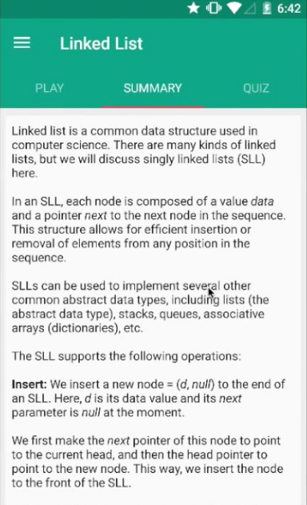

# Structura

Structure is an Android app that teaches students about Data Structures (Trees, Linked Lists) and Algorithms (Linear search, Binary search) in an interactive way.

  
### Screenshots

 <b> Interactive Play  

 <b> Chapters  

 <b> Quizzes  

